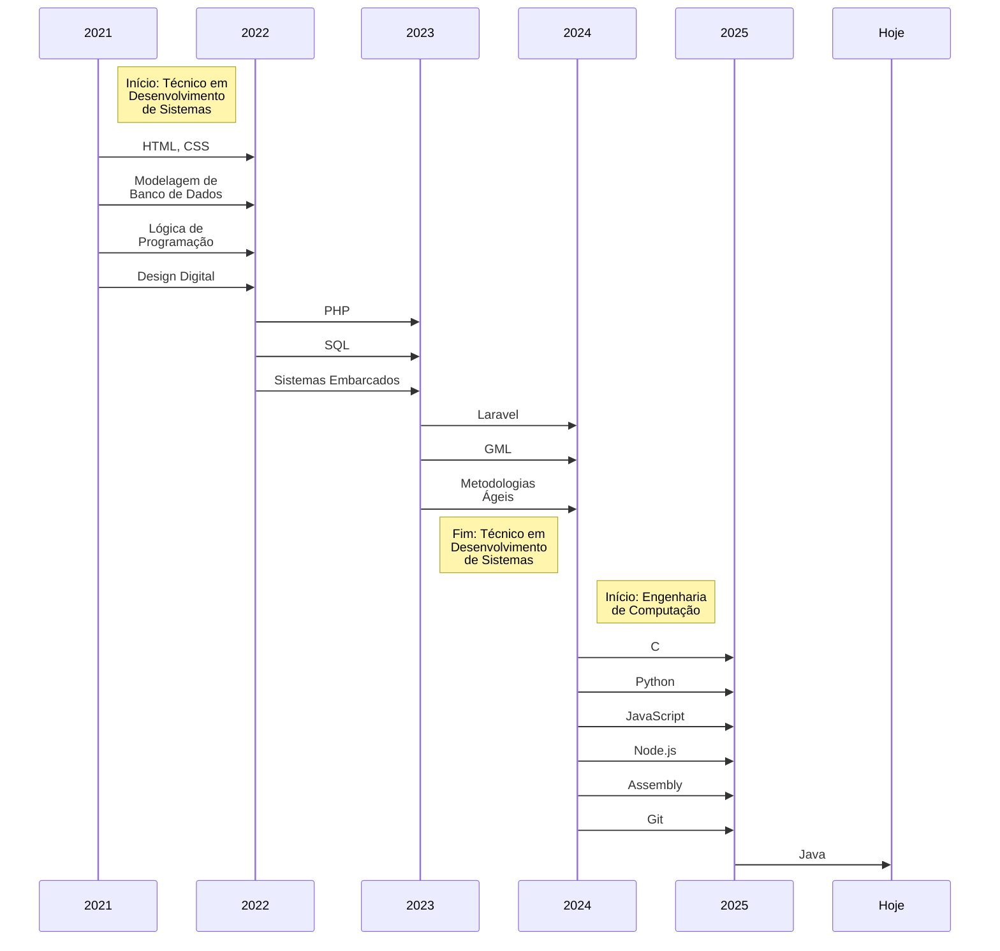

# Carlos Eduardo Almeida do Nascimento  

## Sobre Mim  
- ✅ **Formado:** Técnico em Desenvolvimento de Sistemas (Etec João Belarmino).  
- 🎓 **Cursando:** Engenharia de Computação (PUC Campinas).  
- 🧩 **Conhecimento em:** HTML, CSS, PHP, Laravel, GML, C, Python, JavaScript, Node.js, Assembly, SQL, SCRUM.  

**Trajetória:**  

## Contato
- LinkedIn: https://www.linkedin.com/in/carlos-nascimento-126043269/
- GitHub: [@CarlosEANascimento](https://github.com/CarlosEANascimento)